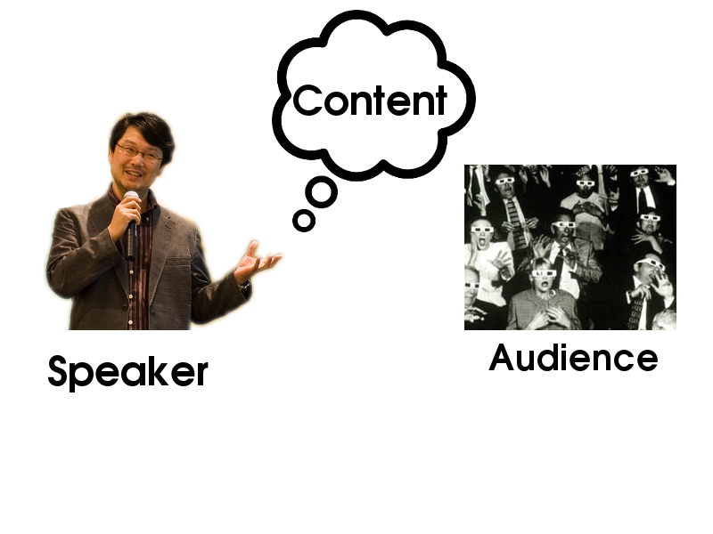
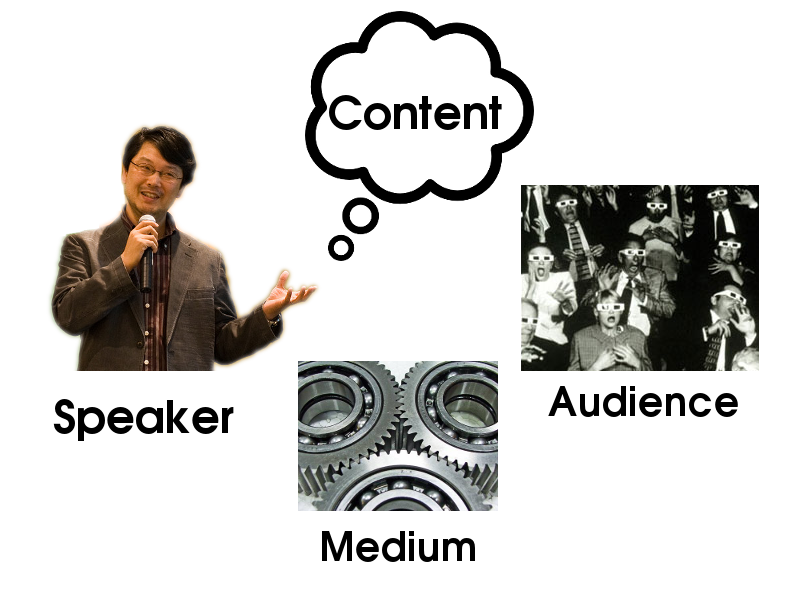
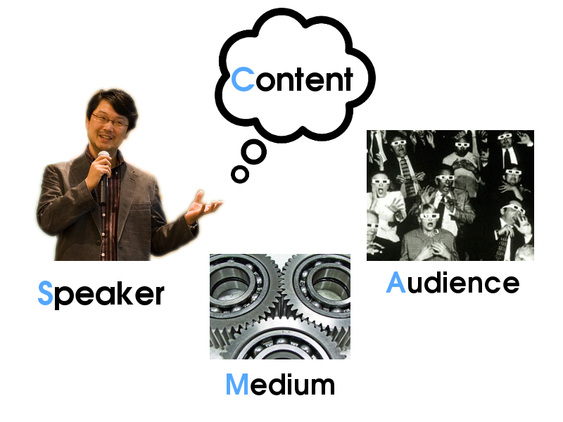
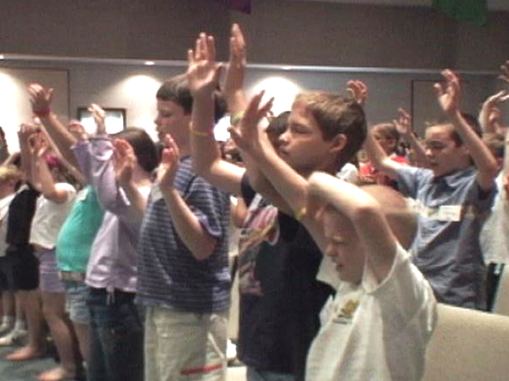
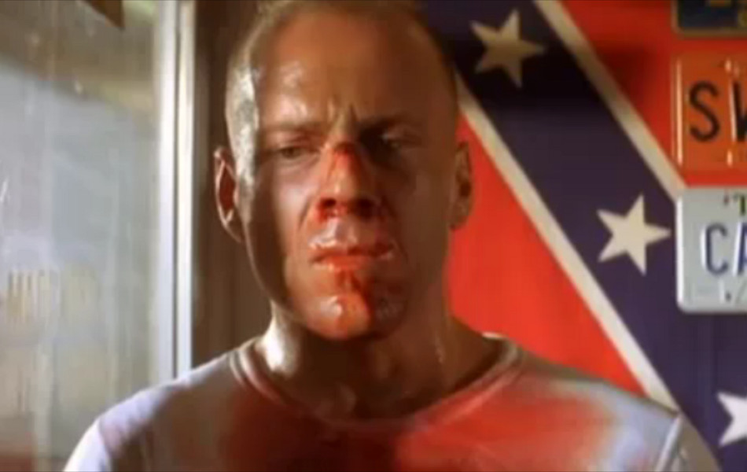
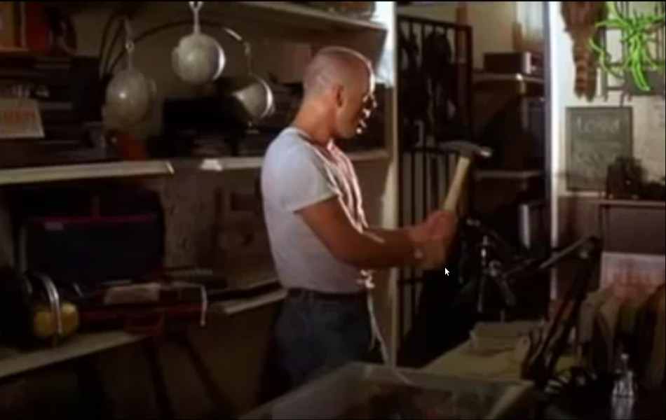
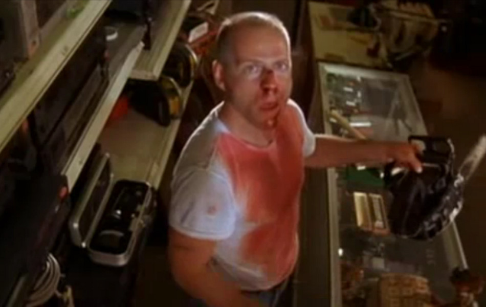
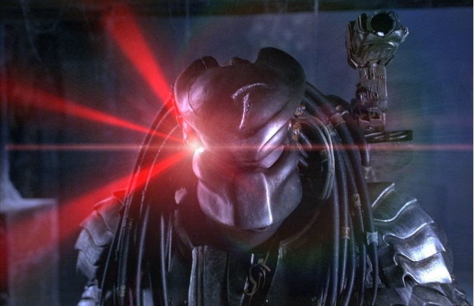
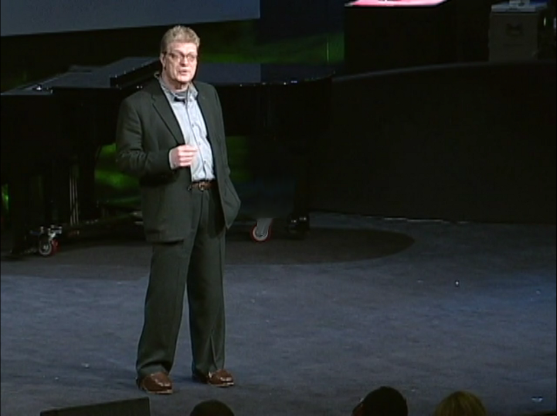
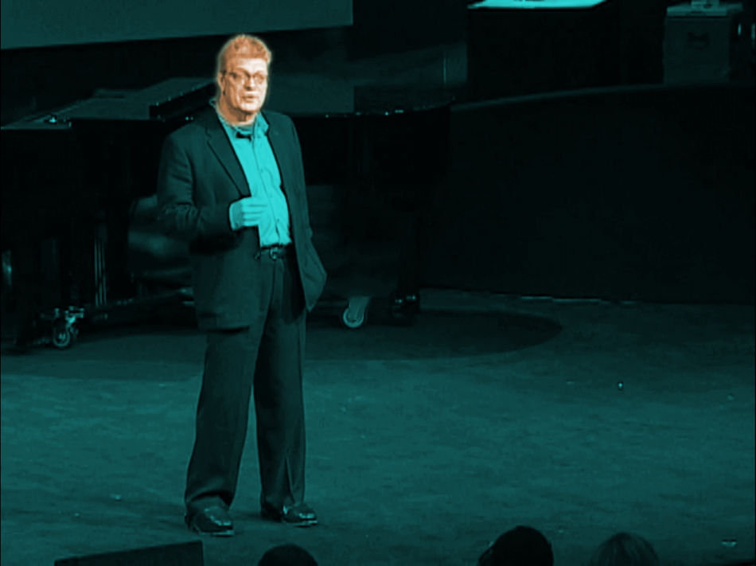

!SLIDE title-slide
# Metatalk #
## A talk about talks ##
### Enrique García (@otikik) ###

!SLIDE bullets
# Index #
* Intro
* Common bits
* Technical bits
* Bonus

!SLIDE bullets
# Index #
* ♥ **Intro**
* Common bits
* Technical bits
* Bonus

!SLIDE bullets
# Index #
* Intro
* ♦ **Common bits**
* Technical bits
* Bonus

!SLIDE bullets
# Index #
* Intro
* Common bits
* ♣ **Technical bits**
* Bonus

!SLIDE bullets
# Index #
* Intro
* Common bits
* Technical bits
* ♠ **Bonus**

!SLIDE subsection
# ♥  Intro #

!SLIDE title-slide
# Speakers around? #

!SLIDE title-slide
# @otikik #

!SLIDE title-slide
# 1 hour vs. several days #

!SLIDE title-slide
# IMHO * #

!SLIDE title-slide
# Guidelines only

!SLIDE bullets
# Index #
* Intro
* ♦ **Common bits**
* Technical bits
* Bonus

!SLIDE title-slide
# What are the "models"? #

!SLIDE center

!SLIDE center

!SLIDE center

!SLIDE center

!SLIDE center

!SLIDE subsection
# SCAM #

!SLIDE title-slide
# What are the "interactions"? #

!SLIDE center

!SLIDE center

!SLIDE center

!SLIDE center

!SLIDE center

!SLIDE title-slide
# Audience + Medium #

!SLIDE center

!SLIDE center

Becky Fischer

!SLIDE center

!SLIDE center

!SLIDE center

What would jesus do?

!SLIDE center

!SLIDE center

!SLIDE title-slide
# Audience + Content #

!SLIDE center

!SLIDE center

!SLIDE center

!SLIDE center

!SLIDE center

!SLIDE center

!SLIDE center

!SLIDE center

!SLIDE center

!SLIDE title-slide
# Audience + Medium #

!SLIDE title-slide
# Medium != Content #

!SLIDE title-slide
# Slides != Content #

!SLIDE title-slide
# Slides == Medium[x]

!SLIDE center

!SLIDE center

!SLIDE center

!SLIDE center

!SLIDE center

!SLIDE center

!SLIDE center

!SLIDE center

!SLIDE center

